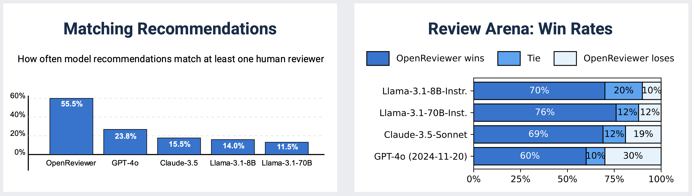

# OpenReviewer: A Specialized Large Language Model for Generating Critical Scientific Paper Reviews

[](https://aclanthology.org/2025.naacl-demo.44/)
[](https://huggingface.co/spaces/maxidl/openreviewer)
[](https://huggingface.co/maxidl/Llama-OpenReviewer-8B)

**OpenReviewer** is an open-source system for generating high-quality peer reviews of machine learning and AI conference papers. At its core is **Llama-OpenReviewer-8B**, an 8B parameter language model specifically fine-tuned on 79,000 expert reviews from top conferences like ICLR and NeurIPS.

## 🎯 Key Features

- **Specialized Model**: Fine-tuned on 79K expert reviews from top ML/AI conferences
- **Critical Evaluation**: Generates realistic, critical reviews that match human reviewer standards
- **Structured Output**: Follows conference-specific review templates and guidelines
- **PDF Processing**: Extracts full text including equations and tables from PDF submissions
- **Open Source**: Complete system available for research and development

## 📊 Performance Highlights

Our evaluation on 400 test papers shows that OpenReviewer significantly outperforms general-purpose LLMs:



## 🚀 Quick Start

### Online Demo
Try OpenReviewer instantly at: **[https://huggingface.co/spaces/maxidl/openreviewer](https://huggingface.co/spaces/maxidl/openreviewer)**

### Using the Model
Refer to [app.py](https://huggingface.co/spaces/maxidl/openreviewer/blob/main/app.py) on how to load the model, convert pdfs and setup the prompt.

## 📁 Repository Structure

- **`openreview_dataset_creation/`**: Scripts for creating datasets from OpenReview
- **`pdf2md/`**: PDF to markdown conversion tools using Marker
- **`llm_training/`**: Training scripts and configurations for the OpenReviewer model
- **~~`app/`~~**: Demo application is hosted separately on [HuggingFace Spaces](https://huggingface.co/spaces/maxidl/openreviewer)

## 🔬 Methodology

### Training Data
- **79,000 reviews** from ICLR and NeurIPS (2022-2025)
- **36,000 papers** converted from PDF to markdown using Marker
- High-confidence reviews filtered by reviewer confidence thresholds


### Model Architecture
- Base model: **Llama-3.1-8B-Instruct**
- **Full fine-tuning** for 3 epochs
- **128k token context length** to handle long papers
- Training: 34 hours on 64x NVIDIA A100 80GB GPUs
- Optimizations: DeepSpeed ZeRO-3, Flash Attention V2, LIGER Kernel

### Review Template
The output of OpenReviewer follows the provided structured template. By defaultit uses the ICLR2025 template.

## 📈 Evaluation Results

### Recommendation Alignment
- **55.5% exact match** with human reviewer recommendations
- **0.96 average error** vs. human ratings (normalized 1-10 scale)
- Significantly outperforms GPT-4o, Claude-3.5, and Llama models

### Review Quality (Arena Evaluation)
OpenReviewer wins against other LLMs in head-to-head comparisons:
- vs. GPT-4o: **60% win rate**
- vs. Claude-3.5-Sonnet: **69% win rate**  
- vs. Llama-3.1-70B: **76% win rate**

## ⚠️ Limitations & Ethical Considerations

- **Not a replacement** for human peer review
- Trained primarily on ML/AI venues (ICLR, NeurIPS)
- Performance may vary for other domains
- Potential bias from training data distribution
- Should be used for **pre-submission feedback** only

## 📚 Citation

If you use OpenReviewer in your research, please cite:

```bibtex
@inproceedings{idahl-ahmadi-2025-openreviewer,
    title = "{O}pen{R}eviewer: A Specialized Large Language Model for Generating Critical Scientific Paper Reviews",
    author = "Idahl, Maximilian  and
      Ahmadi, Zahra",
    editor = "Dziri, Nouha  and
      Ren, Sean (Xiang)  and
      Diao, Shizhe",
    booktitle = "Proceedings of the 2025 Conference of the Nations of the Americas Chapter of the Association for Computational Linguistics: Human Language Technologies (System Demonstrations)",
    month = apr,
    year = "2025",
    address = "Albuquerque, New Mexico",
    publisher = "Association for Computational Linguistics",
    url = "https://aclanthology.org/2025.naacl-demo.44/",
    doi = "10.18653/v1/2025.naacl-demo.44",
    pages = "550--562",
    ISBN = "979-8-89176-191-9"
}
```

## 🔗 Links

- **Paper**: [arXiv:2412.11948](http://arxiv.org/pdf/2412.11948)
- **Demo**: [HuggingFace Spaces](https://huggingface.co/spaces/maxidl/openreviewer)
- **Model**: [HuggingFace Hub](https://huggingface.co/maxidl/Llama-OpenReviewer-8B)

---

*OpenReviewer aims to assist authors with pre-submission feedback while maintaining the highest standards of scientific rigor. It is designed to complement, not replace, human peer review.*